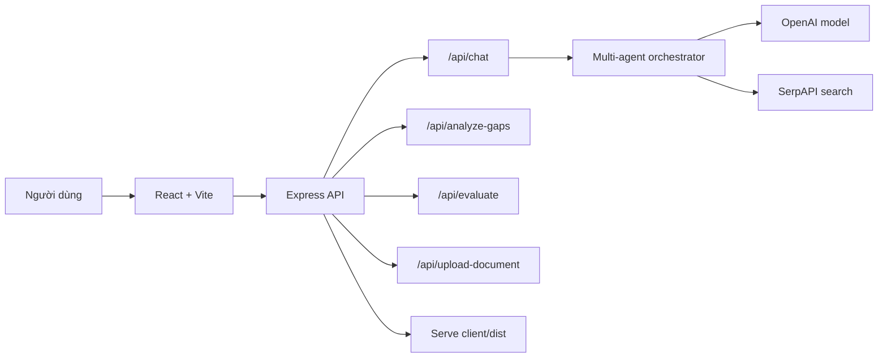

# ReqSense

AI Requirements Analyst giúp biến ý tưởng phần mềm ban đầu thành luồng hỏi đáp có cấu trúc, phân tích khoảng trống yêu cầu và tạo báo cáo đặc tả nghiệp vụ rõ ràng hơn.

[Live demo](https://reqsense-production.up.railway.app/) · [Health check](https://reqsense-production.up.railway.app/health)


## Tổng Quan

ReqSense đóng vai trò như một Business Analyst AI. Người dùng mô tả ý tưởng bằng ngôn ngữ tự nhiên, sau đó hệ thống dẫn dắt qua các vùng yêu cầu quan trọng thay vì hỏi lan man hoặc trả lời một lần rồi dừng.

Ứng dụng phù hợp cho startup, SME, freelancer, agency, Product Manager hoặc BA junior cần làm rõ yêu cầu trước khi chuyển sang thiết kế, báo giá hoặc phát triển.

## Tính Năng Chính

- Hội thoại theo luồng BA với 10 vùng yêu cầu: tổng quan, người dùng, workflow, business rules, phi chức năng, tích hợp, hạ tầng, tuân thủ, timeline, tiêu chí thành công.
- Option chips để người dùng chọn nhanh nhưng vẫn có thể tự nhập câu trả lời.
- Multi-agent pipeline để phân tích yêu cầu, tìm khoảng trống, lập kế hoạch câu hỏi tiếp theo và ghi lại quá trình xử lý.
- Theo dõi độ phủ và confidence theo thời gian thực.
- Upload tài liệu yêu cầu để trích xuất nội dung từ PDF/DOCX/TXT/MD.
- Phân tích gap và đánh giá chất lượng báo cáo.
- Tạo báo cáo đặc tả yêu cầu dạng Markdown.
- Giao diện 3 vùng: tiến độ, hội thoại, phân tích/báo cáo.
- Deploy production trên Railway, frontend được build và serve chung từ Express.

## Tech Stack

| Lớp | Công nghệ |
| --- | --- |
| Frontend | React 18, Vite, CSS modules/plain CSS |
| UI | lucide-react, react-markdown, remark-gfm, rehype-raw |
| Backend | Node.js, Express |
| AI | OpenAI Chat Completions API |
| Search | SerpAPI, dùng cho agent nghiên cứu nếu có cấu hình |
| Upload parsing | pdf-parse, mammoth |
| Deploy | Railway, Nixpacks |

## Kiến Trúc



## Chạy Local

Yêu cầu:

- Node.js 18+
- npm
- OpenAI API key

Clone và cài dependencies:

```bash
git clone https://github.com/dammanhdungvn/ReqSense.git
cd ReqSense
npm install
```

Tạo file môi trường ở `server/.env`:

```env
PORT=3001
OPENAI_API_KEY=your_openai_api_key
OPENAI_MODEL=gpt-4o-mini
SERPAPI_API_KEY=your_serpapi_key_optional
```

Chạy frontend và backend khi phát triển:

```bash
# Terminal 1
npm --workspace server run dev

# Terminal 2
npm --workspace client run dev
```

Mở app tại:

```text
http://localhost:5173
```

Build production:

```bash
npm run build
npm start
```

Sau khi start, backend sẽ serve cả API và frontend build tại:

```text
http://localhost:3001
```

Health check:

```bash
curl http://localhost:3001/health
```

## Cấu Trúc Thư Mục

```text
ReqSense/
├── client/
│   ├── src/
│   │   ├── components/
│   │   ├── api.js
│   │   ├── App.jsx
│   │   └── main.jsx
│   └── vite.config.js
├── server/
│   ├── src/
│   │   ├── chatRoute.js
│   │   ├── multiAgentOrchestrator.js
│   │   ├── evaluateRoute.js
│   │   └── uploadRoute.js
│   └── index.js
├── docs/
│   └── reqsense-product.png
├── package.json
├── package-lock.json
├── nixpacks.toml
└── README.md
```

## API Chính

| Endpoint | Mục đích |
| --- | --- |
| `GET /health` | Kiểm tra server còn sống |
| `POST /api/chat` | Hội thoại BA, sinh câu hỏi tiếp theo hoặc báo cáo |
| `POST /api/analyze-gaps` | Phân tích vùng yêu cầu còn thiếu |
| `POST /api/evaluate` | Đánh giá chất lượng báo cáo |
| `POST /api/upload-document` | Upload và trích xuất nội dung tài liệu |

## Deploy Railway

Project hiện đang được deploy tại:

[https://reqsense-production.up.railway.app/](https://reqsense-production.up.railway.app/)

Railway dùng root workspace:

- `npm run build`: build frontend trong `client`
- `npm start`: chạy Express server trong `server`
- Express serve static files từ `client/dist`

Các biến môi trường cần cấu hình trên Railway:

```env
OPENAI_API_KEY=...
OPENAI_MODEL=gpt-4o-mini
SERPAPI_API_KEY=...
```

## Báo Cáo Đầu Ra

Khi đủ ngữ cảnh, ReqSense có thể tạo báo cáo yêu cầu gồm các phần:

- Project summary
- Functional requirements
- Non-functional requirements
- Actors and roles
- Business rules
- Constraints
- Missing information
- Clarification questions
- Requirement quality assessment
- Risk analysis

## License

MIT
