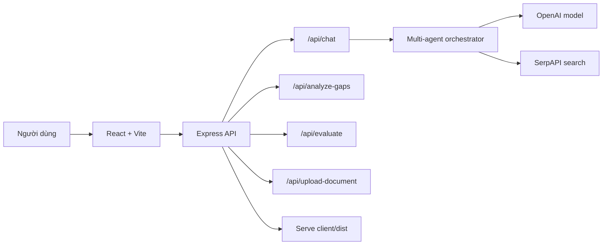

# ReqSense

AI Requirements Analyst giúp biến ý tưởng phần mềm ban đầu thành luồng hỏi đáp có cấu trúc, phân tích khoảng trống yêu cầu và tạo báo cáo đặc tả nghiệp vụ rõ ràng hơn.

[Live demo](https://reqsense-production.up.railway.app/) · [Health check](https://reqsense-production.up.railway.app/health)


## Tổng Quan

ReqSense đóng vai trò như một Business Analyst AI. Người dùng mô tả ý tưởng bằng ngôn ngữ tự nhiên, sau đó hệ thống dẫn dắt qua các vùng yêu cầu quan trọng thay vì hỏi lan man hoặc trả lời một lần rồi dừng.

Ứng dụng phù hợp cho startup, SME, freelancer, agency, Product Manager hoặc BA junior cần làm rõ yêu cầu trước khi chuyển sang thiết kế, báo giá hoặc phát triển.

## Market Scale & Business Validation

ReqSense không chỉ là một chatbot hỏi đáp. Sản phẩm nằm ở giao điểm của bốn nhu cầu đang tăng mạnh: custom software development, requirements management, AI-assisted software delivery và low-code/no-code adoption. Đây là lý do thị trường đủ lớn để chứng minh bài toán có giá trị kinh doanh.

### Quy mô thị trường liên quan

| Thị trường | Quy mô gần nhất | Dự báo | Tốc độ tăng trưởng | Ý nghĩa với ReqSense |
| --- | ---: | ---: | ---: | --- |
| Custom Software Development | $43.16B năm 2024 | $146.18B năm 2030 | 22.6% CAGR | Càng nhiều dự án phần mềm tùy chỉnh, nhu cầu làm rõ requirement trước khi build càng lớn. |
| Requirements Management Software | $2.48B năm 2024 | $5.0B năm 2035 | 6.6% CAGR | ReqSense có thể đóng vai trò lớp thu thập và chuẩn hóa đầu vào trước các công cụ quản trị yêu cầu truyền thống. |
| Low-code Application Development Platform | $24.8B năm 2023 | $101.7B năm 2030 | 22.5% CAGR | Người không chuyên kỹ thuật có thể tự tạo sản phẩm, nhưng vẫn cần cầu nối từ ý tưởng sang đặc tả rõ ràng. |
| Generative AI in SDLC | $624.79M năm 2025 | $9.49B năm 2034 | 35.3% CAGR | AI đang đi sâu vào vòng đời phát triển phần mềm; requirement discovery là một bước có thể tự động hóa mạnh. |

Nguồn tham khảo: [Grand View Research - Custom Software Development](https://www.grandviewresearch.com/industry-analysis/custom-software-development-market-report), [WiseGuy Reports - Requirements Management Software](https://www.wiseguyreports.com/reports/requirements-management-software-market), [Grand View Research - Low-code Platform](https://www.grandviewresearch.com/industry-analysis/low-code-application-development-platform-market), [Fortune Business Insights - Generative AI in SDLC](https://www.fortunebusinessinsights.com/generative-ai-in-software-development-lifecycle-market-109041).

### Luận điểm thị trường

ReqSense nhắm vào một khoảng trống rất cụ thể: trước khi một dự án có Jira ticket, backlog, roadmap hay tài liệu SRS, khách hàng thường mới chỉ có ý tưởng rời rạc. Đây là giai đoạn dễ sai nhất vì requirement chưa rõ, stakeholder chưa thống nhất và đội kỹ thuật chưa đủ thông tin để estimate.

Các công cụ như Jira, Azure DevOps, Notion hoặc Confluence quản lý thông tin tốt sau khi yêu cầu đã được viết ra. ReqSense tập trung vào bước trước đó: hỏi đúng câu, phát hiện thiếu sót, gợi ý option, đo độ phủ và tạo bản nháp đặc tả ban đầu.

### Phân khúc khách hàng mục tiêu

| Phân khúc | Pain point | Vì sao cần ReqSense | Khả năng trả tiền |
| --- | --- | --- | --- |
| Startup & SME | Có ý tưởng nhưng không đủ ngân sách thuê BA senior. | Tạo đặc tả ban đầu để làm việc với dev, agency hoặc nhà đầu tư. | $20-$99/tháng hoặc pay-per-report. |
| Freelance Developer & Tech Agency | Mất nhiều thời gian hỏi khách hàng, dễ scope creep. | Chuẩn hóa intake form thành hội thoại thông minh và xuất report. | $30-$150/tháng theo team nhỏ. |
| Product Manager & BA Junior | Cần framework hỏi yêu cầu có cấu trúc. | Dùng như copilot để không bỏ sót business rules, edge cases, NFR. | $49-$199/tháng cho nhóm sản phẩm. |
| Giáo dục & đào tạo IT/BA | Sinh viên cần học cách phân tích yêu cầu thực tế. | Mô phỏng một BA senior dẫn dắt discovery. | License theo lớp/trường. |

### TAM / SAM / SOM

- TAM: các dự án custom software, low-code/no-code và đội sản phẩm cần chuyển ý tưởng thành yêu cầu phần mềm.
- SAM: nhóm startup, SME, freelancer, agency và PM/BA team cần tài liệu requirement trước khi estimate hoặc phát triển.
- SOM ban đầu: thị trường Việt Nam/Đông Nam Á, nơi nhiều SME và startup muốn build phần mềm nhưng không luôn có BA chuyên trách.

### Đối thủ và lợi thế khác biệt

| Nhóm sản phẩm | Điểm mạnh | Khoảng trống còn lại | Lợi thế của ReqSense |
| --- | --- | --- | --- |
| ChatGPT/Gemini tổng quát | Linh hoạt, trả lời nhanh. | Người dùng phải biết prompt; không track coverage; dễ hỏi lan man. | Luồng BA có cấu trúc, confidence, topic coverage, option chips. |
| Jira/Confluence/Azure DevOps | Quản lý backlog và tài liệu tốt. | Cần requirement đã rõ từ trước. | Hỗ trợ giai đoạn trước backlog: khai phá và chuẩn hóa yêu cầu. |
| Notion AI/Docs AI | Soạn thảo tài liệu nhanh. | Không có cơ chế hỏi sâu theo nghiệp vụ. | Hỏi tiếp theo ngữ cảnh và phát hiện phần còn thiếu. |
| Aha!/ProductPlan | Tốt cho roadmap và planning. | Không chuyên cho requirement elicitation ban đầu. | Tập trung vào discovery, gap analysis và report đặc tả. |

### Mô hình kinh doanh đề xuất

| Gói | Khách hàng | Giá tham khảo | Giá trị chính |
| --- | --- | ---: | --- |
| Free | Cá nhân thử nghiệm | $0 | Số phiên giới hạn, một số report mẫu. |
| Pro | Freelancer, founder, PM cá nhân | $29/tháng | Unlimited sessions, export report, lưu lịch sử. |
| Team | Agency, startup team | $99/tháng | Nhiều seat, workspace, template theo domain. |
| Education/Enterprise | Trường học, công ty | Custom | License theo tổ chức, branding, policy riêng. |

### Động lực tăng trưởng

- AI adoption trong doanh nghiệp khiến các bước phân tích, viết tài liệu và hỗ trợ ra quyết định được tự động hóa nhanh hơn.
- Outsourcing phần mềm tăng làm nhu cầu có đặc tả rõ ràng trước khi báo giá và ký hợp đồng trở nên quan trọng hơn.
- Low-code/no-code mở rộng nhóm người có thể tạo sản phẩm, nhưng nhóm này vẫn thiếu kỹ năng phân tích yêu cầu.
- Remote work làm giao tiếp bất đồng bộ nhiều hơn, vì vậy tài liệu requirement chuẩn trở thành lớp đồng bộ giữa business và technical team.
- Hệ sinh thái công nghệ Việt Nam/Đông Nam Á có nhiều SME, startup và agency nhỏ, phù hợp với công cụ nhẹ, nhanh, chi phí thấp.

## Tính Năng Chính

- Hội thoại theo luồng BA với 10 vùng yêu cầu: tổng quan, người dùng, workflow, business rules, phi chức năng, tích hợp, hạ tầng, tuân thủ, timeline, tiêu chí thành công.
- Option chips để người dùng chọn nhanh nhưng vẫn có thể tự nhập câu trả lời.
- Multi-agent pipeline để phân tích yêu cầu, tìm khoảng trống, lập kế hoạch câu hỏi tiếp theo và ghi lại quá trình xử lý.
- Theo dõi độ phủ và confidence theo thời gian thực.
- Upload tài liệu yêu cầu để trích xuất nội dung từ PDF/DOCX/TXT/MD.
- Phân tích gap và đánh giá chất lượng báo cáo.
- Tạo báo cáo đặc tả yêu cầu dạng Markdown.
- Giao diện 3 vùng: tiến độ, hội thoại, phân tích/báo cáo.
- Deploy production trên Railway, frontend được build và serve chung từ Express.

## Tech Stack

| Lớp | Công nghệ |
| --- | --- |
| Frontend | React 18, Vite, CSS modules/plain CSS |
| UI | lucide-react, react-markdown, remark-gfm, rehype-raw |
| Backend | Node.js, Express |
| AI | OpenAI Chat Completions API |
| Search | SerpAPI, dùng cho agent nghiên cứu nếu có cấu hình |
| Upload parsing | pdf-parse, mammoth |
| Deploy | Railway, Nixpacks |

## Kiến Trúc



## Chạy Local

Yêu cầu:

- Node.js 18+
- npm
- OpenAI API key

Clone và cài dependencies:

```bash
git clone https://github.com/dammanhdungvn/ReqSense.git
cd ReqSense
npm install
```

Tạo file môi trường ở `server/.env`:

```env
PORT=3001
OPENAI_API_KEY=your_openai_api_key
OPENAI_MODEL=gpt-4o-mini
SERPAPI_API_KEY=your_serpapi_key_optional
```

Chạy frontend và backend khi phát triển:

```bash
# Terminal 1
npm --workspace server run dev

# Terminal 2
npm --workspace client run dev
```

Mở app tại:

```text
http://localhost:5173
```

Build production:

```bash
npm run build
npm start
```

Sau khi start, backend sẽ serve cả API và frontend build tại:

```text
http://localhost:3001
```

Health check:

```bash
curl http://localhost:3001/health
```

## Cấu Trúc Thư Mục

```text
ReqSense/
├── client/
│   ├── src/
│   │   ├── components/
│   │   ├── api.js
│   │   ├── App.jsx
│   │   └── main.jsx
│   └── vite.config.js
├── server/
│   ├── src/
│   │   ├── chatRoute.js
│   │   ├── multiAgentOrchestrator.js
│   │   ├── evaluateRoute.js
│   │   └── uploadRoute.js
│   └── index.js
├── docs/
│   └── reqsense-product.png
├── package.json
├── package-lock.json
├── nixpacks.toml
└── README.md
```

## API Chính

| Endpoint | Mục đích |
| --- | --- |
| `GET /health` | Kiểm tra server còn sống |
| `POST /api/chat` | Hội thoại BA, sinh câu hỏi tiếp theo hoặc báo cáo |
| `POST /api/analyze-gaps` | Phân tích vùng yêu cầu còn thiếu |
| `POST /api/evaluate` | Đánh giá chất lượng báo cáo |
| `POST /api/upload-document` | Upload và trích xuất nội dung tài liệu |

## Deploy Railway

Project hiện đang được deploy tại:

[https://reqsense-production.up.railway.app/](https://reqsense-production.up.railway.app/)

Railway dùng root workspace:

- `npm run build`: build frontend trong `client`
- `npm start`: chạy Express server trong `server`
- Express serve static files từ `client/dist`

Các biến môi trường cần cấu hình trên Railway:

```env
OPENAI_API_KEY=...
OPENAI_MODEL=gpt-4o-mini
SERPAPI_API_KEY=...
```

## Báo Cáo Đầu Ra

Khi đủ ngữ cảnh, ReqSense có thể tạo báo cáo yêu cầu gồm các phần:

- Project summary
- Functional requirements
- Non-functional requirements
- Actors and roles
- Business rules
- Constraints
- Missing information
- Clarification questions
- Requirement quality assessment
- Risk analysis

## License

MIT
