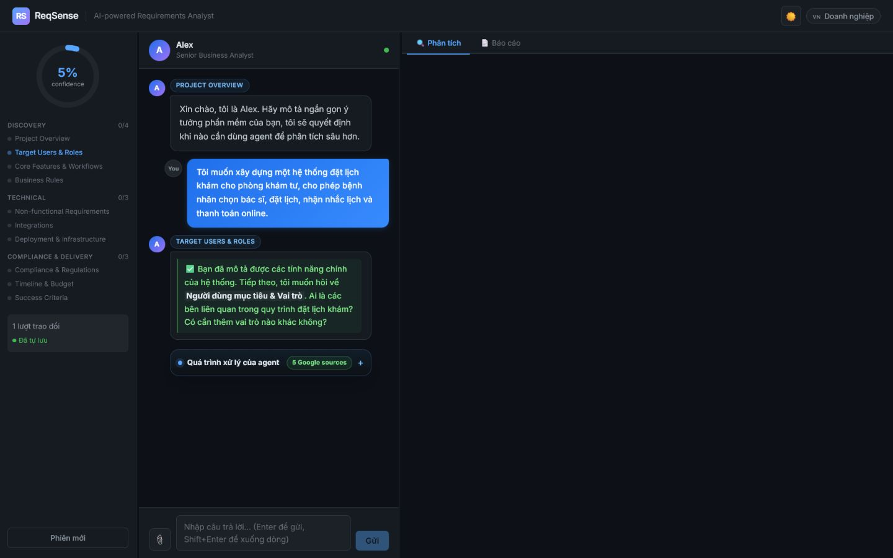
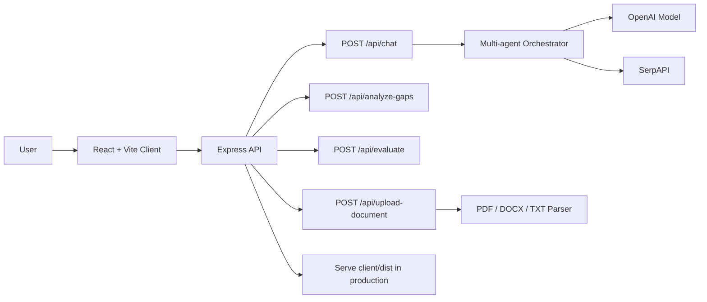

# ReqSense

ReqSense is an AI Business Analyst that helps users turn an early software idea into structured requirements, gap analysis, and a professional requirement report.

Live demo: [https://reqsense-production.up.railway.app](https://reqsense-production.up.railway.app)

Health check: [https://reqsense-production.up.railway.app/health](https://reqsense-production.up.railway.app/health)



## 1. User Pain Point

Many founders, SMEs, freelancers, and non-technical stakeholders know what problem they want to solve, but they do not know how to express that idea as clear software requirements. In real projects, this creates several expensive problems:

- The client explains the idea in broad language, while developers need precise workflows, actors, rules, edge cases, and constraints.
- Teams start building before requirements are complete, leading to rework, scope creep, missed business rules, and inaccurate estimates.
- Hiring a senior Business Analyst is often too expensive for early-stage startups, SMEs, student projects, or small agencies.
- General AI chatbots can answer questions, but they do not reliably guide users through a complete requirement discovery flow.

ReqSense focuses on the moment before a project becomes a backlog, Jira board, or technical specification. This is where many software projects fail: the business idea exists, but the requirement definition is still incomplete.

## 2. Project Idea

ReqSense acts like a lightweight AI Business Analyst. Instead of asking the user to write a perfect prompt, the system leads them through a structured discovery conversation.

The product collects information across 10 requirement areas:

1. Project Overview
2. Target Users & Roles
3. Core Features & Workflows
4. Business Rules
5. Non-functional Requirements
6. Integrations
7. Deployment & Infrastructure
8. Compliance & Regulations
9. Timeline & Budget
10. Success Criteria

The key idea is not simply "chat with AI". ReqSense turns requirement discovery into a guided workflow with coverage tracking, suggested answer options, gap analysis, and a final report that can be used as the first draft for a software project specification.

## 3. Market Scale & Opportunity

ReqSense sits at the intersection of custom software development, requirements management, low-code/no-code adoption, and AI-assisted software delivery. These markets show that the problem is not limited to a small niche; requirement discovery is a recurring need across many software projects.

| Market | Current / Recent Size | Forecast | Growth | Why It Matters |
| --- | ---: | ---: | ---: | --- |
| Custom Software Development | USD 43.16B in 2024 | USD 146.18B by 2030 | 22.6% CAGR | More custom software projects create more demand for clear requirement discovery before development starts. |
| Requirements Management Software | USD 2.48B in 2024 / USD 2.64B in 2025 | USD 5.0B by 2035 | 6.6% CAGR | Existing tools manage requirements after they are written; ReqSense helps create and clarify them earlier. |
| Low-code Application Development Platform | USD 24.83B in 2023 | USD 101.68B by 2030 | 22.5% CAGR | More non-technical users can build software, but they still need help translating ideas into requirements. |
| Generative AI in SDLC | USD 624.79M in 2025 | USD 9.49B by 2034 | 35.3% CAGR | AI is entering the software lifecycle; requirement discovery is a strong use case for AI assistance. |

Sources:

- [Grand View Research - Custom Software Development Market](https://www.grandviewresearch.com/industry-analysis/custom-software-development-market-report)
- [WiseGuy Reports - Requirements Management Software Market](https://www.wiseguyreports.com/reports/requirements-management-software-market)
- [Grand View Research - Low-code Application Development Platform Market](https://www.grandviewresearch.com/industry-analysis/low-code-application-development-platform-market)
- [Fortune Business Insights - Generative AI in Software Development Lifecycle Market](https://www.fortunebusinessinsights.com/generative-ai-in-software-development-lifecycle-market-109041)

### Target Customers

| Segment | Pain Point | ReqSense Value |
| --- | --- | --- |
| Startup founders & SMEs | Have product ideas but cannot afford a senior BA. | Generate a structured first requirement document before hiring developers. |
| Freelance developers & agencies | Spend too much time clarifying vague client requests. | Use ReqSense as a smarter client intake and requirement discovery tool. |
| Product Managers & Junior BAs | Need a structured thinking framework. | Reduce missed requirements and improve early project documentation. |
| IT education & training | Students need practical BA simulation. | Use ReqSense as an interactive requirement analysis practice tool. |

### Competitive Positioning

| Alternative | Strength | Gap | ReqSense Advantage |
| --- | --- | --- | --- |
| ChatGPT / Gemini | Flexible general AI chat. | Depends heavily on user prompting; no built-in requirement coverage tracking. | Structured BA flow, topic coverage, options, and report generation. |
| Jira / Azure DevOps | Strong backlog and project tracking. | Assumes requirements are already clear. | Helps define requirements before they become backlog items. |
| Notion AI / Docs AI | Good for writing and summarizing. | Not specialized for requirement elicitation. | Focused on asking the right business and product questions. |
| Traditional BA consulting | High quality human analysis. | Expensive and not always accessible. | Low-cost first-pass requirement discovery for early-stage teams. |

## 4. Functionality

ReqSense currently supports the core workflow needed to prove the product concept:

- Onboarding flow to adapt the conversation by language, role, and experience level.
- AI-guided requirement conversation with a Senior BA assistant persona.
- Suggested answer options so users can continue even when they are unsure how to respond.
- Coverage tracking across requirement topics.
- Confidence tracking to estimate how complete the collected requirement information is.
- Multi-agent orchestration for requirement analysis, gap detection, research support, and question planning.
- Agent trace UI so users can see why the system asks the next question.
- Document upload for PDF, DOCX, TXT, and Markdown requirement materials.
- Gap analysis to identify missing or weak requirement areas.
- Report evaluation to assess the quality of the generated requirement output.
- Final Markdown report generation with business, functional, non-functional, risk, and clarification sections.
- Production deployment on Railway.

## 5. Tech Stack

| Layer | Technology | Reason |
| --- | --- | --- |
| Frontend | React 18 + Vite | Fast development, component-based UI, production build support. |
| Styling | CSS | Lightweight and easy to customize for a focused prototype. |
| UI Rendering | react-markdown, remark-gfm, rehype-raw | Renders AI responses and generated reports cleanly. |
| Icons | lucide-react | Consistent UI icons without heavy dependencies. |
| Backend | Node.js + Express | Simple API layer for chat, upload, evaluation, and static serving. |
| AI | OpenAI Chat Completions API | Generates structured BA questions, analysis, and reports. |
| Search Support | SerpAPI | Supports external research signals for the agent pipeline. |
| Document Parsing | pdf-parse, mammoth | Extracts text from uploaded PDF and DOCX files. |
| Deployment | Railway | Simple full-stack deployment with environment variables and public domain. |

## 6. System Architecture



The architecture is intentionally practical for a student or early-stage product prototype:

- The frontend and backend are separated during development.
- In production, the React app is built into `client/dist` and served by Express.
- API routes remain under `/api`, which keeps frontend calls simple and deployment-friendly.
- The multi-agent orchestrator is isolated in the backend, so the UI does not need to know the internal reasoning pipeline.

## 7. Feasibility

ReqSense is feasible because it does not require training a new AI model or building a large enterprise platform from scratch. The product uses existing LLM capabilities, then adds product-specific structure around them:

- Requirement topics define the conversation scope.
- The backend controls the output format and report generation.
- The UI tracks progress and makes the interaction easier for non-technical users.
- File upload extends the product from pure chat to document-assisted analysis.
- Railway deployment proves that the system can run as a public web application.

The first practical market entry is not large enterprises. The realistic starting point is small teams that need a first draft of requirements quickly: founders, student teams, freelance developers, and small agencies.

## 8. Demo Flow

1. Open the deployed app.
2. Choose language, role, and experience level.
3. Describe a software idea in natural language.
4. ReqSense asks focused follow-up questions.
5. The user answers manually or selects suggested options.
6. The system updates coverage and confidence.
7. The user can run gap analysis or generate a requirement report.
8. The report becomes a first draft for discussion with developers, stakeholders, or evaluators.

## 9. Local Setup

Requirements:

- Node.js 18+
- npm
- OpenAI API key

Install dependencies:

```bash
git clone https://github.com/dammanhdungvn/ReqSense.git
cd ReqSense
npm install
```

Create `server/.env`:

```env
PORT=3001
OPENAI_API_KEY=your_openai_api_key
OPENAI_MODEL=gpt-4o-mini
SERPAPI_API_KEY=your_serpapi_key_optional
```

Run in development:

```bash
# Terminal 1
npm --workspace server run dev

# Terminal 2
npm --workspace client run dev
```

Open:

```text
http://localhost:5173
```

Production build:

```bash
npm run build
npm start
```

Health check:

```bash
curl http://localhost:3001/health
```

## 10. API Overview

| Endpoint | Purpose |
| --- | --- |
| `GET /health` | Check server status. |
| `POST /api/chat` | Main BA conversation and report generation. |
| `POST /api/analyze-gaps` | Analyze missing requirement areas. |
| `POST /api/evaluate` | Evaluate requirement report quality. |
| `POST /api/upload-document` | Upload and extract text from requirement documents. |

## 11. Project Structure

```text
ReqSense/
├── client/
│   ├── src/
│   │   ├── components/
│   │   ├── api.js
│   │   ├── App.jsx
│   │   └── main.jsx
│   └── vite.config.js
├── server/
│   ├── src/
│   │   ├── chatRoute.js
│   │   ├── multiAgentOrchestrator.js
│   │   ├── evaluateRoute.js
│   │   └── uploadRoute.js
│   └── index.js
├── docs/
│   └── reqsense-product.png
├── package.json
├── package-lock.json
├── nixpacks.toml
└── README.md
```

## 12. Future Development

- Add user accounts and saved projects.
- Export reports to PDF and DOCX.
- Add domain-specific templates, such as e-commerce, healthcare, education, CRM, and booking systems.
- Add collaboration features for founders, developers, and stakeholders.
- Add requirement versioning and change history.
- Improve evaluation scoring with more detailed quality metrics.

## 13. Why This Project Is Worth Building

ReqSense addresses a real and repeated software delivery problem: unclear requirements at the beginning of a project. The product is technically feasible with current AI APIs, has a working deployed prototype, and targets users who need requirement clarity but cannot always afford a professional BA.

The core value is simple: help people ask and answer the right questions before software development begins.

## License

MIT
